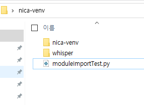

# 용도

| <center> 이름 </center> | <center> 용도 </center> |
|:---|:---:|
| whisper | STT 기능 |
| SpeechRecognition | 음성 입력 |
| gTTS | TTS 기능 |
| playsound | 음성 재생 |
| opencv | 영상 처리 |


<br><br><br>

# 가상환경 설정 가이드

***virtualenv python 3.8.x 가상환경 기준*** 

<br>

## 1. whisper 설치


```
git clone https://github.com/openai/whisper.git
```

```
cd whisper
```
```
pip install -e .
```

<br><br>

## 2. 나머지 설치

```
pip install opencv-python
```

```
pip install gtts
```

```
pip install SpeechRecognition
```

```
pip install playsound
```

<br><br><br>

## 3. 결과



<br><br>

``moduleImportTest.py`` 실행해서 테스트

작업파일은 moudleImportTest랑 동일한 경로에서 실행
